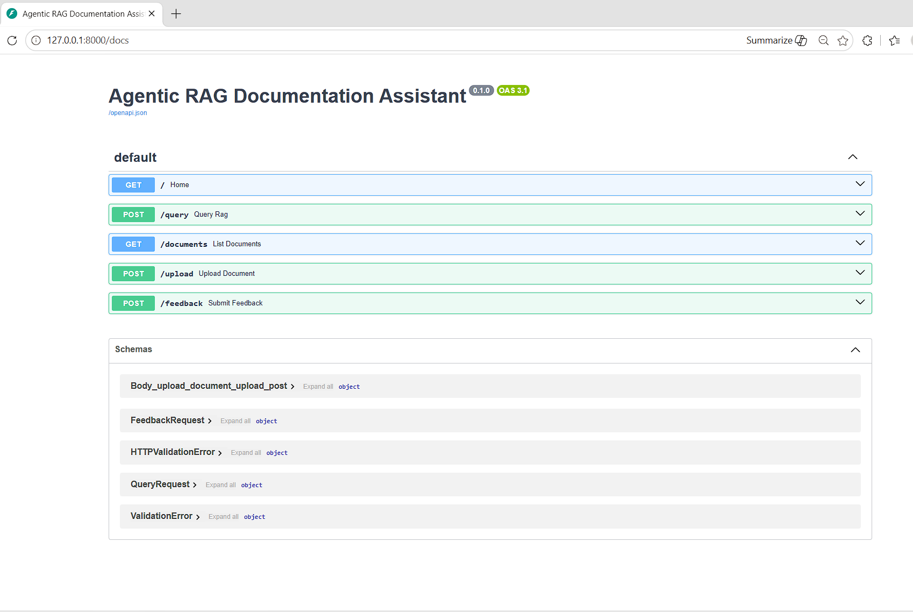
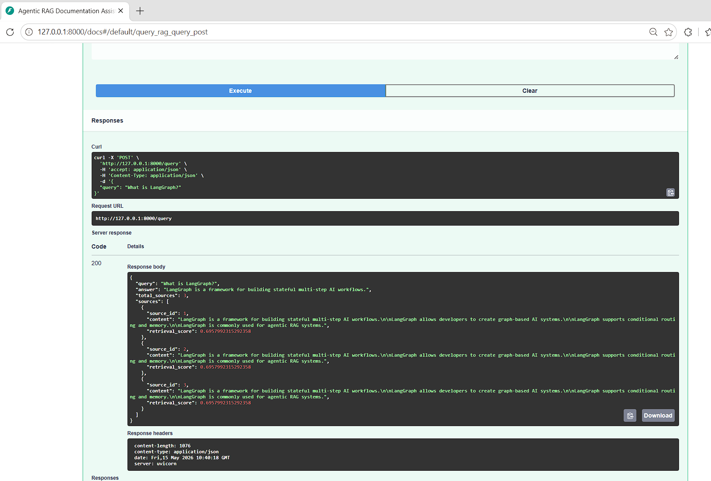
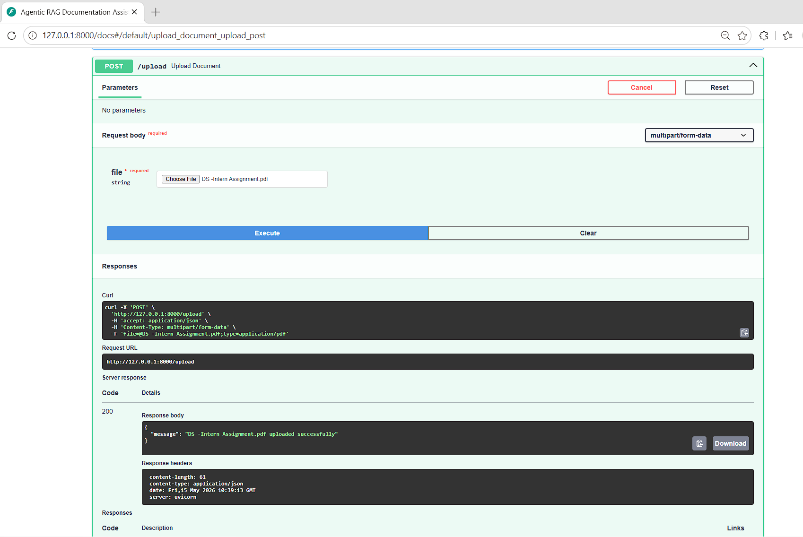
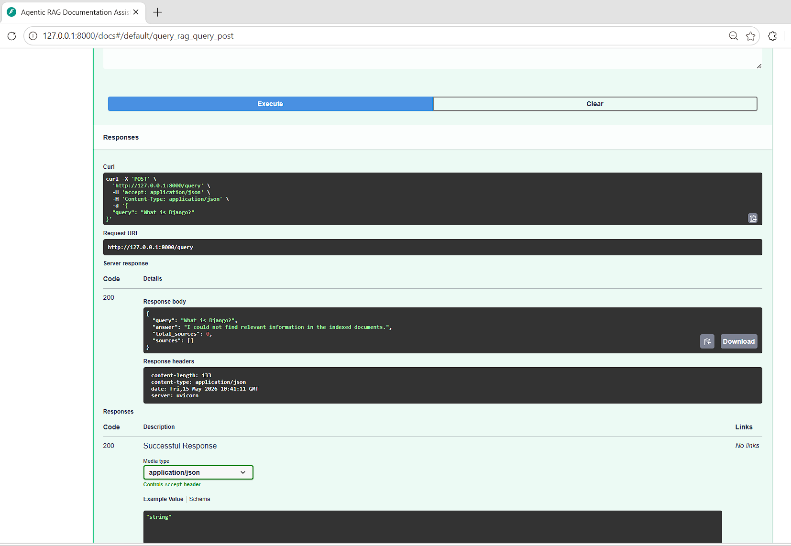

# Agentic RAG Documentation Assistant

An advanced **Agentic Retrieval-Augmented Generation (RAG)** system built using **LangGraph, FastAPI, ChromaDB, and Groq LLMs**.

This project implements a **self-corrective AI workflow** capable of semantic retrieval, document relevance grading, conditional query rewriting, and grounded response generation.

---

# Key Features

## Agentic RAG Workflow

* Built using LangGraph
* Stateful multi-step AI workflow orchestration
* Conditional graph routing
* Retry-based execution flow

## Semantic Retrieval

* ChromaDB vector database
* Sentence-transformer embeddings
* Similarity-based semantic search

## Self-Corrective RAG

* LLM-based document relevance grading
* Automatic query rewriting
* Retry mechanism for failed retrievals
* Hallucination reduction through grounded generation

## Dynamic Document Ingestion

* Upload TXT/PDF documents dynamically
* Automatic chunking and indexing
* Real-time vector database updates

## FastAPI Backend

* RESTful API architecture
* Swagger/OpenAPI documentation
* Structured JSON responses

---

# Tech Stack

* Python
* FastAPI
* LangGraph
* LangChain
* ChromaDB
* Groq LLM
* Sentence Transformers

---

# Workflow Architecture

```text
User Query
     ↓
Query Analyzer
     ↓
Retriever
     ↓
Document Grader
     ↓
Relevant Documents?
   ↙            ↘
 YES             NO
  ↓               ↓
Generate      Rewrite Query
 Answer             ↓
  ↓            Retry Retrieval
 Final Answer
```

---

# API Preview

## Swagger Documentation

Add screenshot here:

```text
screenshots/swagger-ui.png
```

```md

```

---

## Query Response Example

Add screenshot of successful `/query` response.

Example query:

```json
{
  "query": "What is LangGraph?"
}
```

Screenshot path:

```text
screenshots/query-response.png
```

Markdown:

```md

```

---

## Upload Endpoint

Add screenshot showing successful PDF/TXT upload.

Screenshot path:

```text
screenshots/upload-endpoint.png
```

Markdown:

```md

```

---

## Self-Corrective Fallback Response

Add screenshot showing fallback behavior for unsupported queries.

Example:

```json
{
  "query": "What is Django?"
}
```

Expected response:

```json
{
  "answer": "I could not find relevant information in the indexed documents."
}
```

Screenshot path:

```text
screenshots/fallback-response.png
```

Markdown:

```md

```

---

# API Endpoints

## POST `/query`

Query the Agentic RAG system.

### Example Request

```json
{
  "query": "What is LangGraph?"
}
```

---

## POST `/upload`

Upload TXT/PDF documents for automatic ingestion and indexing.

---

## GET `/documents`

Returns indexed document statistics.

---

## POST `/feedback`

Submit user feedback.

---

# Installation

## Clone Repository

```bash
git clone <your-repository-url>
cd agentic-rag-doc-assistant
```

---

## Create Virtual Environment

```bash
python -m venv venv
```

### Windows

```bash
venv\Scripts\activate
```

---

## Install Dependencies

```bash
pip install -r requirements.txt
```

---

# Environment Variables

Create a `.env` file:

```env
GROQ_API_KEY=your_api_key
```

---

# Run FastAPI Server

```bash
uvicorn app.main:app --reload
```

---

# Swagger API Documentation

Open in browser:

```text
http://127.0.0.1:8000/docs
```

---

# Example Capabilities

* Semantic document retrieval
* Query rewriting for failed retrievals
* Grounded answer generation
* PDF/TXT ingestion pipeline
* Retrieval score transparency
* Self-corrective AI workflows

---

# Project Structure

```text
agentic-rag-doc-assistant/
│
├── app/
│   ├── ingestion/
│   ├── nodes/
│   ├── services/
│   ├── utils/
│   ├── graph.py
│   ├── main.py
│   └── state.py
│
├── data/
├── chroma_db/
├── screenshots/
├── README.md
├── requirements.txt
└── .env
```

---

# Future Improvements

* Streamlit/React frontend
* Hybrid search pipelines
* Reranking systems
* Conversation memory
* Multi-agent workflows
* Docker deployment
* Cloud deployment

---

# Author

Rahul Jangir
